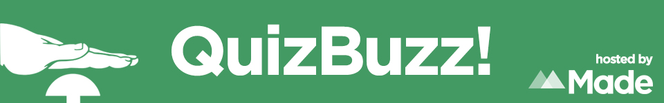

# QuizBuzz!

Made Tech runs a regular meetup event named QuizBuzz, a pub quiz-style evening open to anyone in the tech community, featuring prizes, pizza and drinks. Details of the next event will be posted [here](http://www.meetup.com/QuizBuzz/), feel free to join us for the next one!

After each event, this repo will be updated with the questions that were used on the night.

## Questions

### Language Specific
- [CSS](languages/css.md)
- [HTML](languages/html.md)
- [Java](languages/java.md)
- [JavaScript](languages/javascript.md)
- [PHP](languages/php.md)
- [Python](languages/python.md)
- [Ruby](languages/ruby.md)

### Trivia
- [Programming](trivia/programming.md)
- [Geeky](trivia/geek.md)

### Picture Rounds
- [AWS Services](pictures/aws.md)
- [Famous Programmers](pictures/programmers.md)

